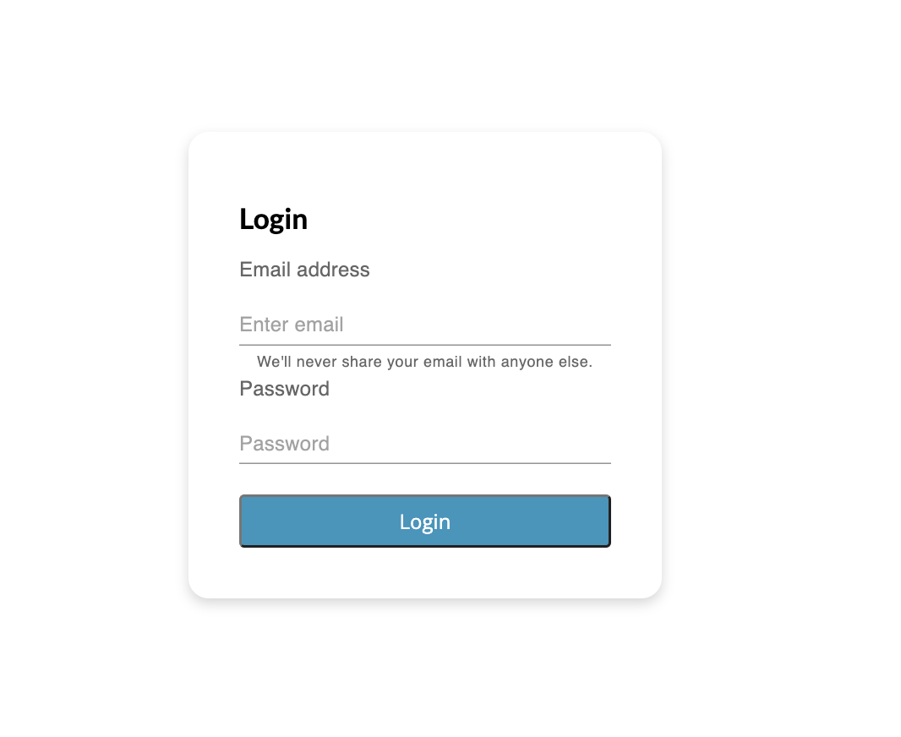
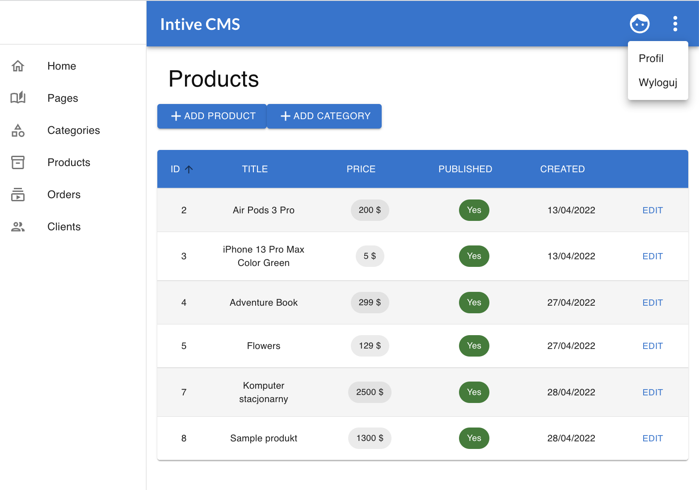
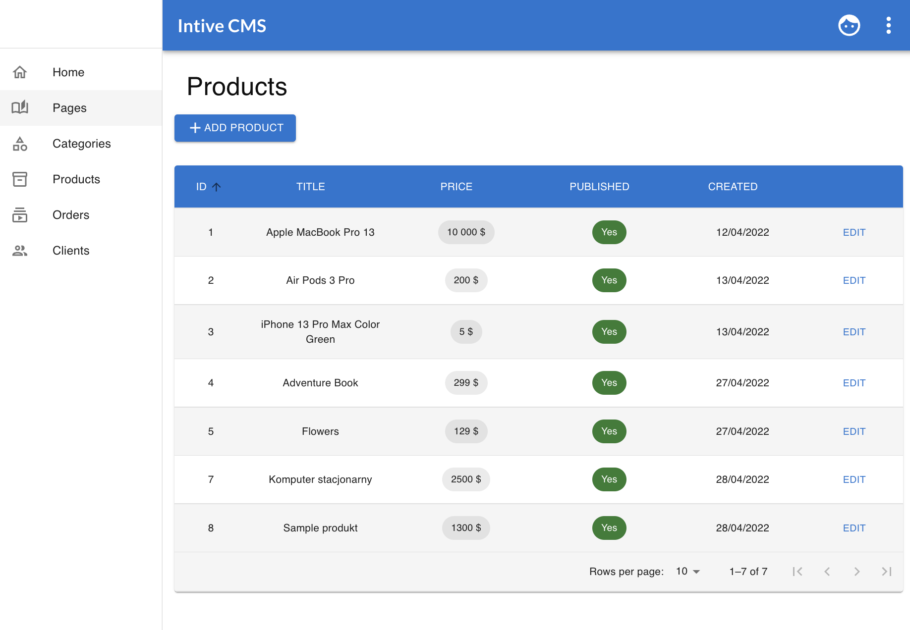
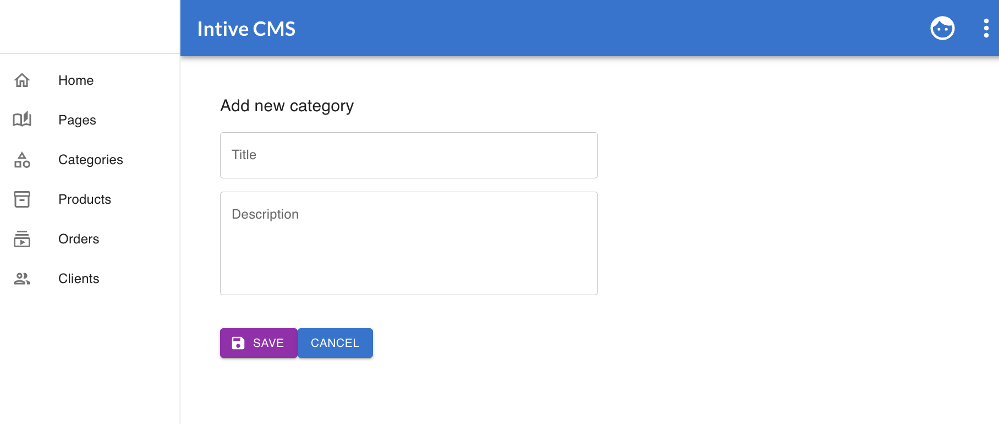
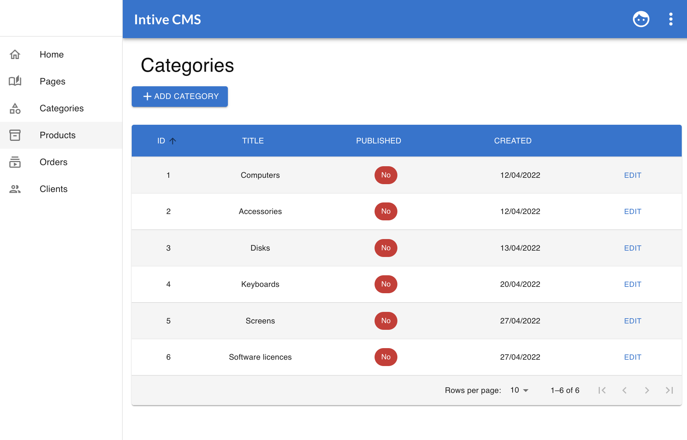
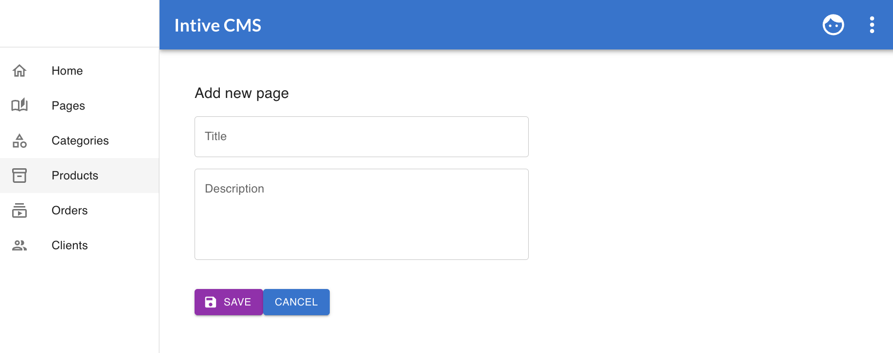
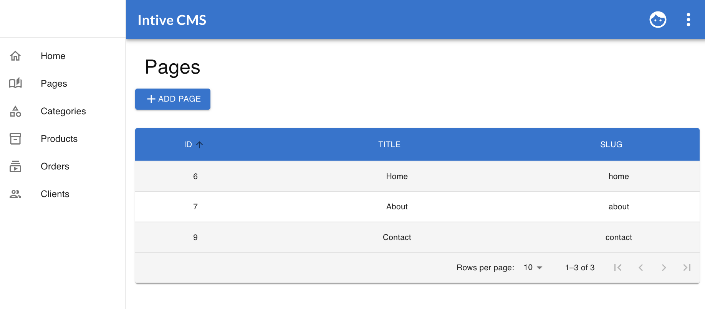
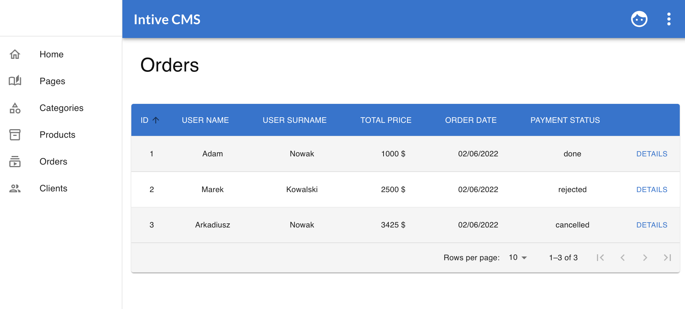
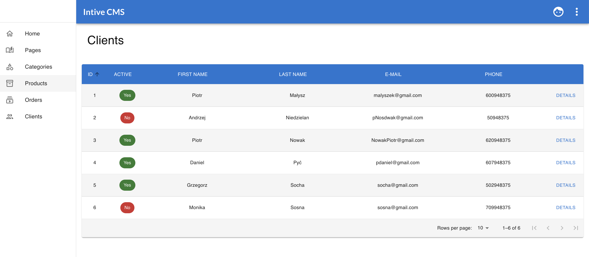
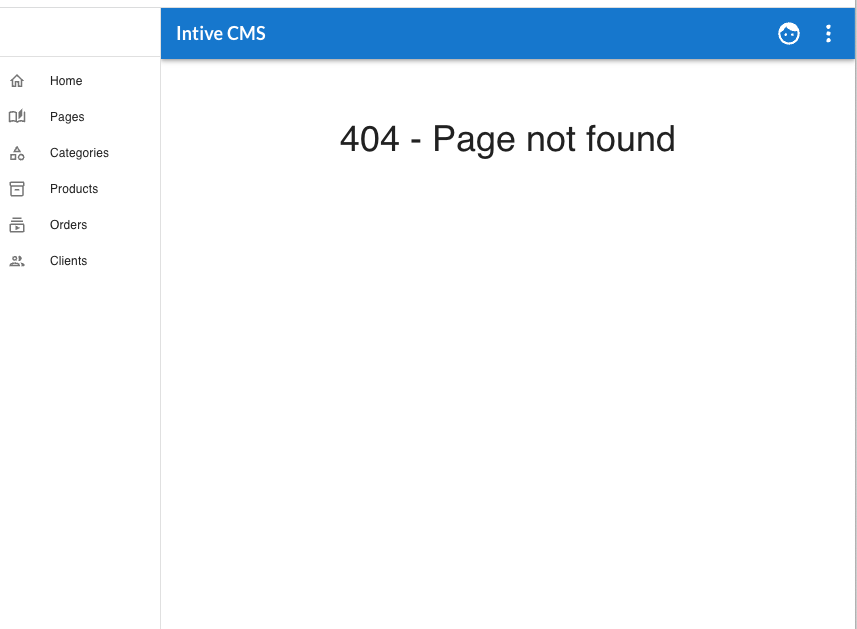

<h1 style="color:#007ac9;border-bottom:none;text-align:center;">Intive Patronage 2022</h1>
<h2 style="text-align:center;border-bottom:none">Lublin JavaScript CMS Panel</h2>

## Table of Contents

- [General Info](#general-information)
- [Technologies Used](#technologies-used)
- [Features](#features)
- [Screenshots](#screenshots)
- [Setup](#setup)
- [Usage](#usage)

## General Information

<h1>Intive CMS</h1>

- Content Management System Panel is based on React 17,
- It's a tool for content self-management
- After introducing new content, information by an authorized editor to CMS (login functionality), the system saves the content and their changes in the database, and photos and other files on the server. Then the CMS system dynamically generates websites based on the content from the database and appropriate CMS templates.

## Technologies Used

- [React](https://reactjs.org) 
- [TypeScript](https://www.typescriptlang.org) 
- [MUI](https://mui.com) 
- [Redux Toolkit](https://redux-toolkit.js.org) 
- [Testing Libreary](https://testing-library.com/docs/react-testing-library/intro/) 
- [Prettier](https://prettier.io) 
- [ESLint](https://eslint.org) 

### Other

- [React Router](https://reactrouter.com)
- [Formik](https://formik.org/)
- [Yup](https://github.com/jquense/yup)
- [Axios](https://axios-http.com/)

## Features

- Log in with Bearer Token
- Dashboard Page Navigation 
- Create form Add Product, Add Category, Add Page with open and closed questions, upload images, select fields
- The results of the completed forms are in filtering and sorting table in pages: Home, Pages, Categories, Products, Orders, Clients

## Screenshots

## Setup

Run `npm install` to install all dependencies needed for this project. They are listed in `package.json` file.

## Usage

`npm start` - to run the app

The server is running on port 3000

### Styling

- We use styled components (https://mui.com/pt/system/styled/)

## Git-Flow

- master (production)
- develop
- feature/\*
- release/\*
- bugfix/\*
- hotfix/\*

## Contributors

[@DmytroTarasiuk](https://github.com/DmytroTarasiuk)

[@ostafinskim](https://github.com/ostafinskim)

[@Edyta2801](https://github.com/Edyta2801)

[@JakubSoldek](https://github.com/JakubSoldek)

[@kamilszalast](https://github.com/kamilszalast)

[@FranekPoland](https://github.com/FranekPoland)

[@KacperStoczkowski](https://github.com/KacperStoczkowki)

[@Misiorny](https://github.com/Misiorny)

### Team Leaders

[@dblach-intive](https://github.com/dblach-intive)

[@patrykomiotek](https://github.com/patrykomiotek)

